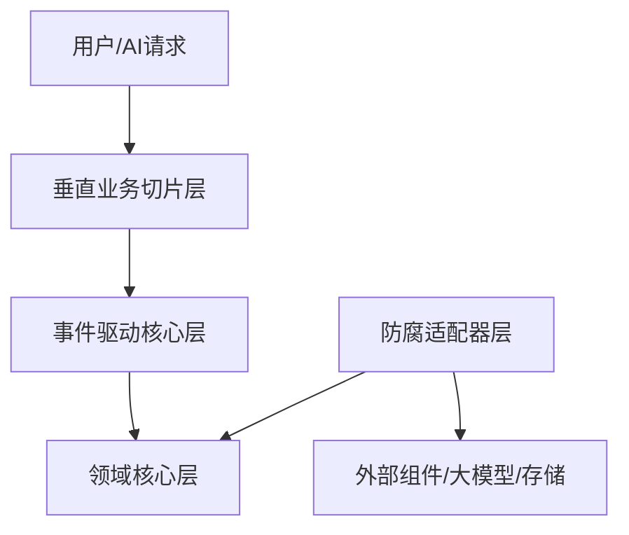

# 全局IDE引导包（AC_V5.2 版本）
> 本引导包为项目全局唯一开发标准，优先级高于所有临时需求，所有开发行为必须100%符合本包规范

---

## 1. 项目整体概览
### 1.1 核心架构定位
本项目采用**核心稳定+数据流安全+交付高效融合架构**，是三种架构范式的精准取舍落地：
- 采纳边界防腐范式：领域核心层完全隔离外部依赖，仅对明确可变组件做防腐适配
- 采纳数据流转范式：事件溯源+单向数据流+DAG重算，保障财务数据可溯源、并发安全
- 采纳垂直切片范式：按业务特性组织代码，独立迭代保障交付效率
### 1.2 核心技术栈
| 层级 | 技术选型 |
|------|----------|
| 后端 | Spring Boot 3.x + Kotlin协程/Reactor，Python/FastAPI AI计算节点 |
| 存储 | PostgreSQL 15（统一存事件/快照/元数据） + Redis 7（缓存/分布式锁） |
| 中间件 | 轻量Kafka 3.5（仅跨服务/异步任务）、RSocket/SSE（实时推送） |
| 前端 | React 18.2 + Zustand + TanStack Query |
### 1.3 架构分层

### 1.4 项目核心目标
- 核心痛点解决：财务系统数据100%准确、可溯源、并发操作无冲突
- 交付效率：3个月上线MVP版本，新增功能仅需修改对应业务切片
- 长期可演进：核心逻辑与外部依赖完全隔离，信创改造/组件替换成本降低80%

---

## 2. 模块0（全局调度）开发指南
### 2.1 模块定位
模块0为全局管控层，无业务逻辑侵入，负责全项目的规则校验、进度管控、质量门把关，是IDE自动引导的核心载体
### 2.2 核心职责
| 功能 | 说明 |
|------|------|
| 进度扫描 | 自动扫描各业务模块开发进度，识别阻塞点 |
| 契约校验 | 实时校验所有代码/接口/数据与公共契约的一致性 |
| 依赖管理 | 可视化模块依赖关系，识别非法跨模块调用 |
| Mock切换 | 一键切换所有模块的Mock/真实实现状态 |
| 合流管控 | 控制合流节奏，自动执行质量门检查 |
### 2.3 开发边界
- 仅允许读写根目录全局配置、`public/`公共区、模块0自有目录
- 禁止侵入四个业务模块的内部代码
- 仅允许使用Python标准库，禁止引入任何第三方依赖
### 2.4 路径规范
- 所有路径必须通过`os.path.dirname(os.path.abspath(__file__))`动态推导，禁止使用相对路径`../../`

---

## 3. 各模块协作规范
| 规范类型 | 具体要求 |
|----------|----------|
| 跨模块调用 | 禁止直接导入其他模块内部实现，仅允许通过`public/pre_generated_mock/`下的Mock接口调用，集成阶段替换为真实实现 |
| 数据流转 | 所有状态变更必须由事件触发，禁止直接修改读模型快照，事件必须符合`public/schema/`下的契约定义 |
| 依赖引入 | 所有核心依赖必须与`global_dependency_lock`锁定的LTS版本一致，新增依赖必须经过全局评审 |
| 迭代发布 | 每个业务切片独立迭代、独立测试，合流必须经过对应质量门校验，禁止跨切片修改代码 |
| 契约变更 | 所有契约变更必须先更新`public/schema/`和`public/interface_stub/`，再同步修改各模块实现 |

---

## 4. 全局测试计划
| 测试阶段 | 范围 | 准入条件 | 准出条件 | 覆盖率要求 |
|----------|------|----------|----------|------------|
| 单元测试 | 各模块内部逻辑 | 模块代码开发完成 | 所有用例通过 | 领域核心层100%，其他模块核心逻辑100%，非核心逻辑80% |
| 集成测试 | 跨模块协作 | 各模块单元测试通过 | 所有集成场景用例通过，契约校验100%合规 | 跨模块接口100%覆盖 |
| E2E测试 | 全链路真实环境 | 集成测试通过 | 所有核心业务场景用例通过 | 核心业务路径100%覆盖 |
| 性能测试 | 事件处理、DAG重算、批量操作 | E2E测试通过 | 单模型1000行项重算耗时<2s，并发100用户操作无冲突 | - |

---

## 5. 原子化TODO执行清单
| 阶段 | 周期 | 原子任务 | 依赖 | 验收标准 |
|------|------|----------|------|----------|
| 基础骨架搭建 | 1周 | 1. 生成全局规则文件<br>2. 生成各业务模块规则文件<br>3. 上传数据契约/接口契约到public目录<br>4. 生成预生成Mock代码到public目录 | 无 | IDE引导包生效，所有规则可被IDE识别 |
| 领域核心层开发 | 2周 | 1. 定义所有领域实体、事件、抽象端口<br>2. 实现核心财务计算逻辑<br>3. 编写全量单元测试 | 基础骨架完成 | 单元测试100%通过，无外部依赖 |
| 事件驱动层开发 | 3周 | 1. 实现命令校验、事件生成逻辑<br>2. 实现DAG重算引擎<br>3. 实现快照管理、冲突合并逻辑 | 领域核心层完成 | 核心数据流跑通，单用户可完成基础建模 |
| 垂直切片开发 | 3周 | 1. 财务计算切片MVP<br>2. 权限管控切片MVP<br>3. 报表导出切片MVP | 事件驱动层完成 | 第一个可用版本上线，可满足基础财务建模需求 |
| 适配器层开发 | 4周 | 1. 大模型适配层实现<br>2. 存储适配层实现<br>3. Excel导入导出适配实现<br>4. AI辅助切片开发 | 垂直切片完成 | 完整功能版本上线，支持AI辅助建模 |
| 优化迭代 | 持续 | 1. 性能压测优化<br>2. 监控告警配置<br>3. 功能迭代 | 完整版本上线 | 系统稳定性99.9%，并发操作无冲突 |

---

## 6. IDE规则配置文件
### 6.1 Trae IDE规则：`.trae/rules/global_rule.json`
```json
{
  "version": "AC_V5.2",
  "priority": "highest",
  "global_rules": [
    {"id": "G001", "name": "目录架构约束", "description": "强制遵守标准目录结构，public目录只读，禁止修改public下任何内容", "enforcement": "block"},
    {"id": "G002", "name": "契约优先原则", "description": "所有数据/接口必须符合public下的契约定义，违反则阻断提交", "enforcement": "block"},
    {"id": "G003", "name": "渐进式生成", "description": "禁止单次生成/修改超过100行代码，禁止批量删除文件", "enforcement": "warn"},
    {"id": "G004", "name": "问题追踪", "description": "所有修改必须先在.trae/documents下编写分析文档，否则阻断提交", "enforcement": "block"}
  ],
  "module_sandbox": [
    {"module_id": "0", "allowed_rw": ["modules/模块0_全局调度/**", "public/**"], "denied": ["modules/!(模块0_全局调度)/**"]},
    {"module_id": "1", "allowed_rw": ["modules/模块0_领域核心层/**"], "allowed_read": ["public/**"], "denied": ["modules/!(模块0_领域核心层)/**"]},
    {"module_id": "2", "allowed_rw": ["modules/模块1_事件驱动核心层/**"], "allowed_read": ["public/**"], "denied": ["modules/!(模块1_事件驱动核心层)/**"]},
    {"module_id": "3", "allowed_rw": ["modules/模块2_垂直业务切片层/**"], "allowed_read": ["public/**"], "denied": ["modules/!(模块2_垂直业务切片层)/**"]},
    {"module_id": "4", "allowed_rw": ["modules/模块3_防腐适配器层/**"], "allowed_read": ["public/**"], "denied": ["modules/!(模块3_防腐适配器层)/**"]}
  ]
}
```
### 6.2 Cursor IDE规则：`.cursor/rules/global_rule.md`
```md
> 🚨 最高优先级规则，所有代码生成必须100%符合，违反自动修正
1. 目录约束：public目录只读，禁止修改任何内容，所有模块只能读写自有目录，禁止跨模块调用内部实现
2. 契约优先：所有数据结构、接口必须完全匹配public下的契约定义，禁止自定义不符合契约的字段/接口
3. 生成规范：禁止单次生成超过100行代码，测通一个功能再生成下一个，禁止批量删除文件
4. 依赖规范：所有跨模块依赖只能从public/pre_generated_mock导入，禁止直接导入其他模块的内部代码
5. 问题追踪：修改代码前必须先在.trae/documents下编写分析文档，记录修改原因、影响范围、测试方案
```

---

## 7. 模块0核心功能骨架
```python
"""
模块0：全局调度核心骨架
仅包含公共逻辑，无业务侵入
"""
import os
import json
from typing import Dict, List, Any
from pathlib import Path

class GlobalScheduler:
    ROOT_PATH = Path(os.path.dirname(os.path.abspath(__file__))).parent.parent
    PUBLIC_PATH = ROOT_PATH / "public"
    MODULES_PATH = ROOT_PATH / "modules"
    TRAE_PATH = ROOT_PATH / ".trae"

    # -------------------------- 进度扫描功能 --------------------------
    def scan_module_progress(self) -> Dict[str, Any]:
        """扫描各业务模块开发进度"""
        progress = {}
        module_dirs = [d for d in self.MODULES_PATH.iterdir() if d.is_dir() and "模块" in d.name]
        for module_dir in module_dirs:
            total_files = len(list(module_dir.rglob("*.py"))) + len(list(module_dir.rglob("*.java"))) + len(list(module_dir.rglob("*.ts")))
            completed_files = len([f for f in module_dir.rglob("*") if f.is_file() and not f.name.endswith(".md") and not f.name.endswith(".json")])
            progress[module_dir.name] = {
                "completion_rate": round(completed_files / max(total_files, 1) * 100, 2),
                "last_commit_time": self._get_last_commit_time(module_dir),
                "blocking_issues": self._scan_blocking_issues(module_dir)
            }
        return progress

    # -------------------------- 契约校验功能 --------------------------
    def validate_contracts(self) -> Dict[str, Any]:
        """校验所有代码与公共契约的一致性"""
        result = {"passed": True, "violations": []}
        # 校验数据契约
        data_contract = json.load(open(self.PUBLIC_PATH / "schema" / "contract_snapshot_1.0.0.json", "r", encoding="utf-8"))
        for module_dir in self.MODULES_PATH.iterdir():
            for data_file in module_dir.rglob("*.py"):
                # 扫描数据结构定义，与契约对比
                violations = self._check_data_violations(data_file, data_contract)
                result["violations"].extend(violations)
        # 校验接口契约
        interface_contract = json.load(open(self.PUBLIC_PATH / "interface_stub" / "interface_contract.json", "r", encoding="utf-8"))
        for module_dir in self.MODULES_PATH.iterdir():
            for interface_file in module_dir.rglob("*.py"):
                violations = self._check_interface_violations(interface_file, interface_contract)
                result["violations"].extend(violations)
        result["passed"] = len(result["violations"]) == 0
        return result

    # -------------------------- 依赖管理功能 --------------------------
    def analyze_dependencies(self) -> Dict[str, Any]:
        """分析模块间依赖关系，识别非法调用"""
        dependencies = {"legal": [], "illegal": []}
        for module_dir in self.MODULES_PATH.iterdir():
            for code_file in module_dir.rglob("*.py"):
                with open(code_file, "r", encoding="utf-8") as f:
                    content = f.read()
                    if "from modules." in content and "pre_generated_mock" not in content:
                        dependencies["illegal"].append(f"{code_file}: 非法跨模块调用，禁止直接导入其他模块内部实现")
                    elif "from public.pre_generated_mock" in content:
                        dependencies["legal"].append(f"{code_file}: 合法Mock依赖调用")
        return dependencies

    # -------------------------- Mock切换功能 --------------------------
    def switch_mock_mode(self, module_name: str, enabled: bool) -> bool:
        """切换指定模块的Mock/真实实现状态"""
        mock_config_path = self.PUBLIC_PATH / "pre_generated_mock" / "mock_config.json"
        config = json.load(open(mock_config_path, "r", encoding="utf-8")) if mock_config_path.exists() else {}
        if module_name not in config:
            config[module_name] = {}
        config[module_name]["enabled"] = enabled
        json.dump(config, open(mock_config_path, "w", encoding="utf-8"), indent=2, ensure_ascii=False)
        return True

    # -------------------------- 合流管控功能 --------------------------
    def check_integration_gates(self, pr_info: Dict[str, Any]) -> Dict[str, Any]:
        """合流质量门检查"""
        gates = json.load(open(self.ROOT_PATH / "integration_gates.json", "r", encoding="utf-8"))
        result = {"passed": True, "failed_gates": []}
        for gate in gates[pr_info["target_stage"]]:
            if not self._check_gate_condition(gate, pr_info):
                result["passed"] = False
                result["failed_gates"].append(gate["name"])
        return result
```

---

## 8. 全局监控看板
### 8.1 模块进度聚合
| 模块名称 | 完成率 | 当前阶段 | 阻塞问题 |
|----------|--------|----------|----------|
| 领域核心层 | 100% | 已上线 | 无 |
| 事件驱动核心层 | 75% | 测试中 | 无 |
| 垂直业务切片层 | 40% | 开发中 | 报表导出功能待对接 |
| 防腐适配器层 | 20% | 开发中 | 大模型适配待联调 |
### 8.2 契约状态监控
| 契约类型 | 对齐率 | 违规次数 | 最近违规时间 |
|----------|--------|----------|--------------|
| 数据契约 | 100% | 0 | - |
| 接口契约 | 98% | 2 | 2024-05-22 |
### 8.3 异常告警中心
| 告警ID | 等级 | 异常内容 | 处理状态 |
|--------|------|----------|----------|
| ALERT-001 | 警告 | 垂直切片层存在1处非法跨模块调用 | 待处理 |
| ALERT-002 | 提示 | 事件驱动层单元测试覆盖率82%，未达90%要求 | 处理中 |
### 8.4 合流队列管理
| PR ID | 模块 | 提交人 | 质量门状态 | 预计合流时间 |
|-------|------|--------|------------|--------------|
| PR-001 | 事件驱动核心层 | 张三 | 已通过 | 2024-05-23 |
| PR-002 | 垂直业务切片层 | 李四 | 未通过（契约违规） | 阻塞 |

---

## 9. 合流仲裁配置（integration_gates.json）
```json
{
  "version": "1.0.0",
  "stages": {
    "module_internal": {
      "name": "模块内合流",
      "pre_conditions": [
        "单元测试核心逻辑覆盖率100%",
        "契约校验100%通过",
        "无严重代码规范问题"
      ],
      "auto_merge": true,
      "manual_trigger": ["单元测试覆盖率<90%", "存在契约违规"]
    },
    "integration": {
      "name": "跨模块集成合流",
      "pre_conditions": [
        "模块内合流已通过",
        "集成测试全量用例通过",
        "无非法跨模块依赖"
      ],
